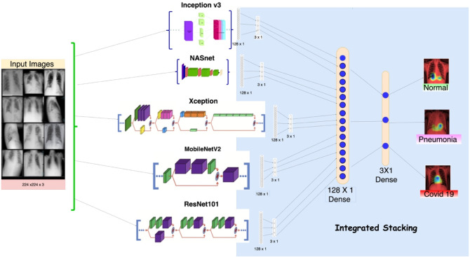
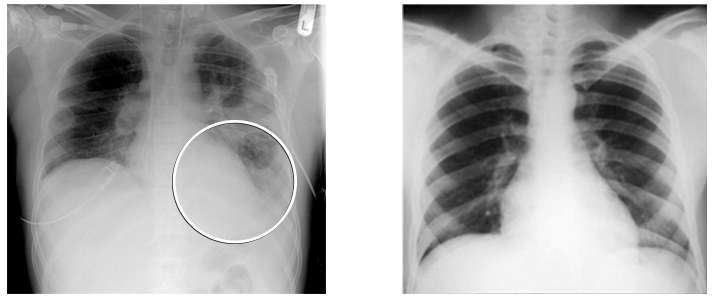

# **Final Project - Pneumonia identification from X-Ray**
### Big Data Engineering

*by Yaiza ARNAIZ ALCACER, Pablo MARCOS LOPEZ*

## Abstract

Pneumonia is a serious illness characterised by a severe cough with phlegm, fever, chills and shortness of breath, which is caused by inflammation of the alveoli in one or both lungs. Despite advances in the diagnosis and treatment of lung infections, pneumonia is the sixth leading cause of death in adults in the United States, with more than six million cases of acute pneumonia each year, one million of which require hospitalisation.

The simplest way to determine the extent and location of the infection, so that it can be treated more efficiently, is by taking chest X-rays; however, at present, analysis of these X-rays is limited to what humans are capable of, with the time delays and enormous costs that this entails.

The aim of this paper is to present a complete model of thoracic X-ray image analysis, which we have developed by stacking two different Machine Leaning models, so that future scientists can build on it to hopefully improve the diagnostic lead times and economic efficiency of this class of tests.

The results after training with two epochs is unexpected for the small loss obtained. The model implemented does not learn what is needed for an accurate classification. Nevertheless we configure a scalable model following the current state of the art and prove the transfer learning of more than one model stacking them together. As a follow up 
experiment, the transfer learning can be still done with more than one model but instead stacking, a voting system could be implemented. 

## INTRODUCTION

### Description of the illness

Pneumonia is a disease characterised by infection and inflammation of the air sacs of one (unilateral) or two (bilateral) of the lungs, and especially of the alveoli. These are small "clusters" located at the end of each bronchus whose function is to allow oxygen to enter our blood; however, during pneumonia, part of them may end up filling with fluid or pus, preventing air from entering. 

The spectrum of germs responsible for pneumopathies is broad, and new pathogens are constantly being identified: it may be caused by bacteria, but it is also possible that a virus, such as influenza or COVID-19, is responsible for the infection. Despite advances in the diagnosis and treatment of lung infections, pneumonia remains a major cause of morbidity and mortality in adults, representing the sixth leading cause of death in the United States, with more than six million cases each year, more than one million of which require hospitalisation. 

**Symptoms**

Signs and symptoms of pneumonia vary from mild to severe, depending on factors such as the type of germ causing the infection, age and general health. Mild signs and symptoms are often similar to those of a cold or flu, but last longer. These may include:

* Chest pain when breathing or coughing.
* Nausea, vomiting or diarrhoea.
* Difficulty breathing
* Coughing, which may produce phlegm
* Fatigue
Fever, sweating and/or chills * Lower than normal body temperature 
* In adults aged 65 years and older it may also cause confusion or changes in mental awareness and a lower than normal body temperature (the latter is common in people with a weakened immune system).

Newborns and infants may sometimes show no signs of infection, but may also vomit, have fever and cough, appear restless or tired and lack energy, or have difficulty breathing and eating.

#### Risk factors

* Children under 2 years of age or younger
* People 65 years of age or older
* Being hospitalised, especially if you are on a ventilator
* Tingling
Chronic diseases such as asthma or heart disease * Weakened or suppressed immune system 
* Weakened or suppressed immune system

#### Diagnosis

The most common methods are:

* Blood tests to confirm an infection and try to identify the type of organism that has caused the pneumonia. 
* Chest x-ray to determine the extent and location of the infection.
* Pulse oximetry to measure the level of oxygen in the blood. 
* Sputum test to obtain a sample of fluid from the lungs. 
* In case of a more serious condition, a CT scan or pleural fluid culture may also be performed. 

As can be seen, the most common methods of diagnosis are based on clinical data, appropriate microbiological tests and chest X-rays, which can quickly demonstrate parenchymal abnormalities. Radiography is an important element in the initial evaluation of any patient with suspected pneumopathy, but diagnosis remains a challenge, as pneumopathies with identical clinical and radiological signs may have different germs as their origin.

The most common treatments include antibiotics to treat bacterial pneumonia, cough medicines and fever reducers, but the prognosis is poor: 2.63% of infected patients eventually die, a rate even higher than measles or HIV in their worst years, but lower than other monsters such as Ebola. It is because of this that proper and early diagnosis is essential, to prevent the disease from progressing further and further complicating patient survival.

### Current state of the art for classification of X Ray Images

As we have seen, the inference of medical diagnoses from X-ray images is an essential feature in the diagnosis of pneumonia. However, during the CoViD-19 pandemic in which we live, the number of doctors available (either due to contagion or confinement) has radically decreased, while demand has increased due to coronavirus-derived pneumonia cases, creating a bottleneck that needs an urgent solution.

Thus, the potential of Deep Learning models of X-ray images has been investigated for some years now to hopefully find a model with sufficient accuracy, recall and precision for the detection of COVID-19 induced pneumonia using chest radiography without human supervision. In the paper ["InstaCovNet-19: A deep learning classification model for the detection of COVID-19 patients using Chest X-ray"](https://www.sciencedirect.com/science/article/pii/S1568494620307973), *Gupta et al* present a model that, precisely, is able to achieve greater than 99% accuracy (much higher than human) by stacking pre-existing networks called Iception, NASnet, Xception, MobileNetV2 and ResNet, all of which are image classification models. 

Our original idea was to study the performance of this model (InstaCovNet-19), but, since its code is not available, and knowing, thanks to this paper, that stacking neural networks significantly improves its results, we have decided to **design our own model using (py)Spark and integrated stacking**.

## Matherials and Methods

### Dataset Description

To train, test and validate our models, we have used a dataset of validated OCT images and chest X-rays as described and analysed in "Deep learning-based classification and referral of treatable human diseases", [available on Mendeley Data under CC-By-Sa 4.0 licence](https://data.mendeley.com/datasets/rscbjbr9sj/2).

This dataset consists of a group of chest X-ray images (anterior-posterior) selected from retrospective cohorts of paediatric patients aged one to five years from the *Guangzhou Women and Children's Medical Center* in Guangzhou (China), selecting for quality control all poor quality or unreadable scans. The diagnostic images were graded by two medical experts before being cleared for AI system training and, in order to account for any grading errors, the evaluation set was also reviewed by a third expert. All radiographs were performed as part of the patients' routine clinical care.

The images are divided into a training set and a separate patient test set. Images are labelled as (disease)-(random patient ID)-(image number for each patient) and divided into 4 directories: CNV, DME, DRUSEN and NORMAL.
The images are labelled as (disease)-(random patient ID)-(image number for each patient) and divided into 3 folders: Training and Test, which are part of the original dataset; and Validation, which separates 16 images for purposes of checking the validity of the model. Each of these three folders contains the subfolders "normal" and "Pneumonia", to compare between positive and negative patients.

### Workflow

Our pipeline, which can be found in more detail in "Annex_I_X_ray_images_big_data" at the end of this document, uses technologies such as pyspark, orca and pytorch to process the data, checking that the stacking works as it should and providing the results we can provide in the following section.

## Results and discussion

The accuracy is lower as expected taking in account the model. As observed, the loss is very small but the accuraccy remains lower. The loss indicate how well learn the model, showing that there are a problem referring to what it is learning, since the accuracy is not good.

It is difficult to scale a integrate neural network like the one of the paper since use 5 neural network in total. Some bigger than others and all of then with a really different last layer. For example, inception_v3 is a really good model for x-ray image classification and a lot of previous works with transfer learning with inception_V3 have shown already this fact. Nevertheless is a really big model and stuck this model with another requires in the training a big memory ram that the current set up didn't have disponible.

Taking this into account, take the inceptio_V3 and do the transfer learning could be a good option but such experiment would'nt be original neither fun, since was an experiment already tried by a lot of previous works.

As a follow up experiment, we would use still transfer learning of different models good in image classification but without stacking them together, and at the end we would have implemented a voting system between the models.

## REFERENCES

  - Anunay Gupta,  Anjum, Shreyansh Gupta, Rahul Katarya - InstaCovNet-19: A deep learning classification model for the detection of COVID-19 patients using Chest X-ray, Applied Soft Computing, Volume 99, 2021, 106859, ISSN 1568-4946, https://doi.org/10.1016/j.asoc.2020.106859. (https://www.sciencedirect.com/science/article/pii/S1568494620307973)
  - Daniel Kermany, Kang Zhang, Michael Goldbaum - Labeled Optical Coherence Tomography (OCT) and Chest X-Ray Images for Classification, 6 January 2018, Version 2, DOI: 10.17632/rscbjbr9sj.2, https://data.mendeley.com/datasets/rscbjbr9sj/2?__hstc=25856994.9a09a91357a104706292fa960434cfb0.1643116296328.1643116296328.1643116296328.1&__hssc=25856994.1.1643116296328&__hsfp=4215451866 
  - Daniel S. Kermany,Michael Goldbaum,Wenjia Cai,Carolina C.S. Valentim,Huiying Liang,Sally L. Baxter,Alex McKeown,Ge Yang,Xiaokang Wu,Fangbing Yan,Justin Dong,Made K. Prasadha,Jacqueline Pei,Magdalene Y.L. Ting,Jie Zhu,Christina Li,Sierra Hewett et al. - Identifying Medical Diagnoses and Treatable Diseases by Image-Based Deep Learning, Cell, Elsevier, 22 February 2018, DOI:https://doi.org/10.1016/j.cell.2018.02.010, https://www.cell.com/cell/fulltext/S0092-8674(18)30154-5.
- Fuzhen Zhuang, Zhiyuan Qi, Keyu Duan, Dongbo Xi, Yongchun Zhu, Hengshu Zhu, Senior Member, IEEE,
Hui Xiong, Fellow, IEEE, and Qing He - A Comprehensive Survey on Transfer Learning. https://arxiv.org/abs/1911.02685v3

